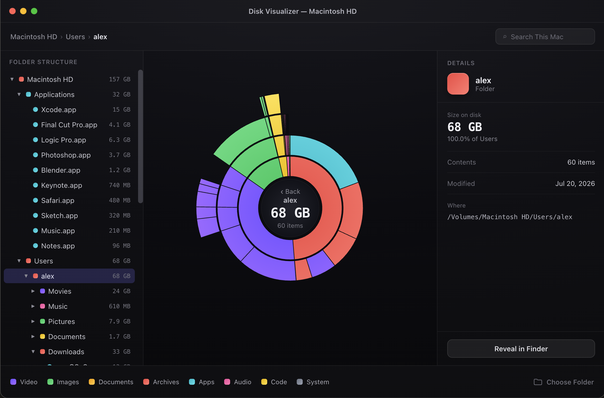

# Disk Visualizer

A native macOS app that scans a folder and visualizes its disk usage as an
interactive sunburst chart.



## Features

- Pick any folder and scan it for disk usage, color-coded by file category
  (video, image, document, app, audio, archive, other).
- Navigate the sunburst by clicking segments to drill into subfolders, or use
  the synchronized sidebar tree and breadcrumbs.
- Search across the scanned tree.
- Details panel with size, kind, and path for the selected item.
- Follows the system light/dark appearance.

## Requirements

- macOS 26.5 or later
- Xcode 17 or later

## Build & run

Open `Disk Visualizer.xcodeproj` in Xcode and run the `Disk Visualizer`
scheme, or build from the command line:

```bash
xcodebuild -scheme "Disk Visualizer" -destination "platform=macOS" build
```

To build a Release build and install it into `/Applications` (pass `-u` to
install into `~/Applications` instead):

```bash
Scripts/install.sh
```

### Full Disk Access

The app is not sandboxed, so it can scan TCC-protected locations (e.g. inside
`~/Library`) once granted **Full Disk Access** in System Settings ▸ Privacy &
Security. Without it, the scanner simply skips folders it can't read.

## Tests

```bash
xcodebuild -scheme "Disk Visualizer" -destination "platform=macOS" test
```

## Design

The UI was implemented from an HTML/CSS design handoff in
[`docs/design/`](docs/design/); see [`CLAUDE.md`](CLAUDE.md) for how the
Swift code maps to it.

## License

[MIT](LICENSE)
